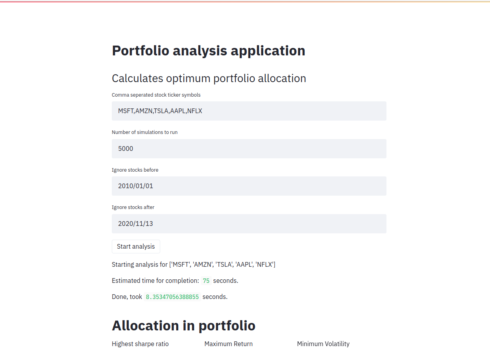
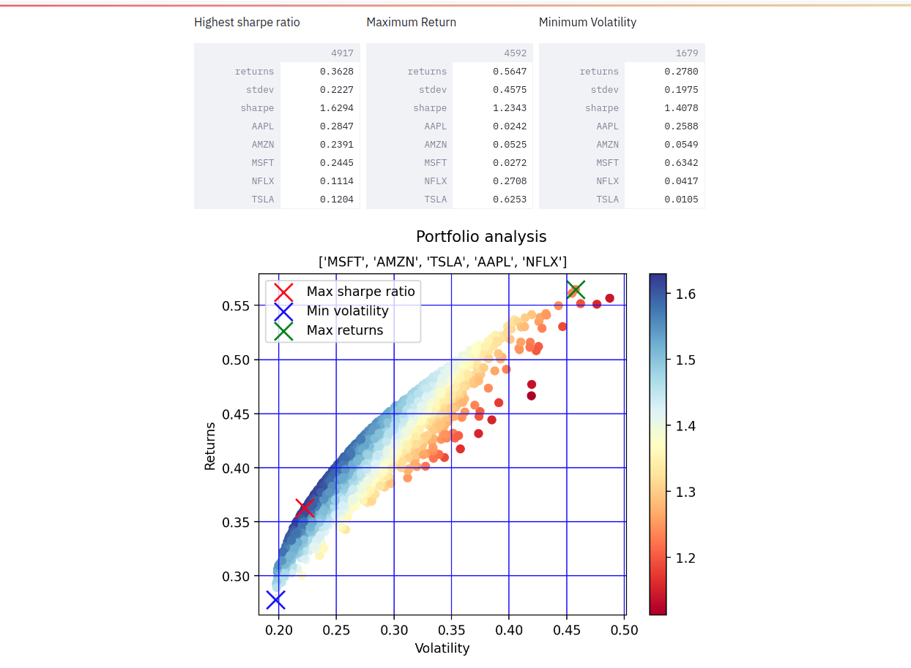

# Portfolio allocation application using AlphaVantage and Streamlit

Pick your stocks, pick # of simulations and get results.

Portfolio analysis application, that finds portfolio allocation with best return, lowest volatility and highest sharpe ratio by applying a predefinded number of montecarlosimulations to the portfolio.

## Deployment:
1. Clone repo
2. Install streamlit via `pip install streamlit`
3. Hand over alphavantage API key via  `export ALPHAVANTAGE_API_KEY=XXX`
4. > `streamlit start app.py`